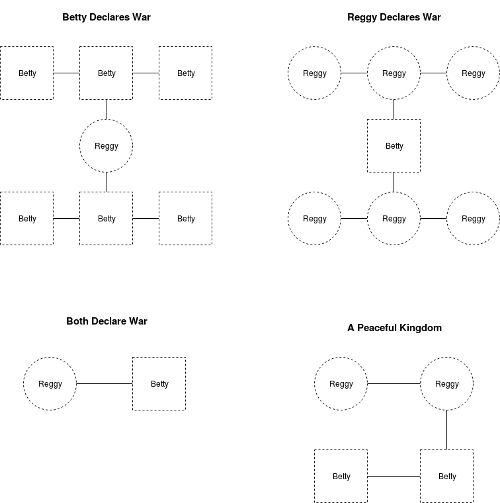
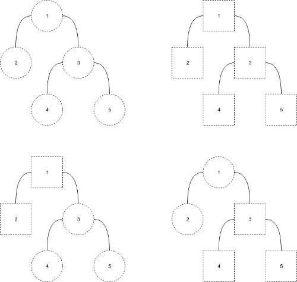

# Kingdom Division

---

King Arthur has a large kingdom that can be represented as a tree, where nodes correspond to cities and edges correspond to the roads between cities. The kingdom has a total of __*n*__ cities, numbered from 1 to __*n*__.

The King wants to divide his kingdom between his two children Reggie and Betty, by giving each of them 0 or more cities; however, they don't get along so he must divide the kingdom in such a way that they will not invade each other's cities. The first sibling will invade the second sibling's city if the second sibling has no other cities directly connected to it. For example, consider the kingdom configurations below.



Given a map of the kingdom's __*n*__ cities, find and print the number of ways King Arthur can divide it between his two children such that they will not invade each other. __The result can be quite large, so give the answer modulo 10<sup>9</sup> + 7.__

## Input Format

The first line contains a single integer denoting __*n*__, the number of cities in the kingdom.

Each of the __*n*__ - 1 subsequent lines contain two space-separated integers, __*u*__ and __*v*__, describing a road connecting cities.

## Constraints

- 2 ≤ __*n*__ ≤ 10<sup>5</sup>
- 1 ≤ __*u, v*__ ≤ __*n*__
- It is guaranteed that all cities are connected.

## Output Format

Print the number of ways to divide the kingdom such that the siblings will not invade each other, modulo 10<sup>9</sup> + 7

## Sample Input
```
5
1 2
1 3
3 4
3 5
```

### Sample Output
```
4
```

### Explanation

In the diagrams below, square-shaped cities are ruled by Betty and circular cities are ruled by Reggie. These diagrams show the four valid ways to divide the kingdom peacefully.



We then print the value of 4 mod (10<sup>9</sup> + 7) = 4 as our answer.